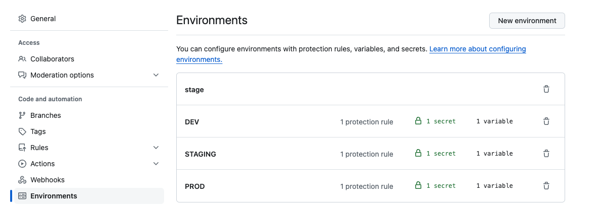
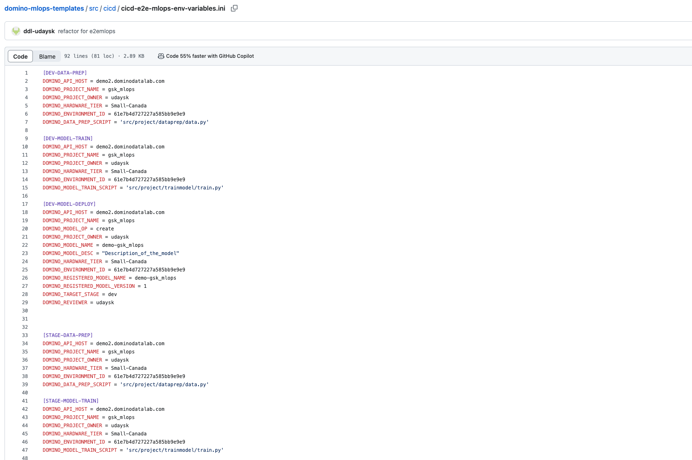

# Domino MLOps Templates

Welcome to the Domino MLOps solution repository! This project serves as a comprehensive starting point for implementing MLOps within Domino.

MLOps entails a collection of repeatable, automated, and collaborative workflows, incorporating best practices. It empowers teams of ML professionals to efficiently deploy their machine learning models into production after approval from various stages of the ML ops pipeline.

## Project Overview

This solution offers a modular end-to-end approach for MLOps within Domino, covering Jobs, Models, and Apps publishing.

## Prerequisites

- A Domino subscription with host endpoint URL and user API access key.
- A GitHub account capable of creating environments and adding corresponding variables to them.
- Understanding of GitHub workflows.

## Methodology

This project template demonstrates the usage of GitHub Actions workflows for CI/CD and employs Domino Data Planes, representing different hardware tier for different stages of the OPS pipeline.

For this template project, we would establish three Dataplanes representing three stages in the Domino experiment manager.We would create three GitHub environments, each mapping to the corresponding stage in the Dataplane and experiment manager of Domino. Progressing through the CI/CD pipeline involves changing the stage in the experiment manager and approving the stage in GitHub to advance the deployment to next dataplane on domino.

## GitHub

The project utilizes GitHub Actions workflows located in the `.github/workflows/` folder for e2e mlops pipeline. The pipeline includes stages for data preparation , model training and model deployment. There are three workflows dev, staging and production representing different stages for ops pipeline. The config file "cicd-e2e-mlops-env-variables.ini" at src/cicd folder in the repo provides option to configure your data prep , training or deployment during diffrent stages of your ml ops pipeline  

### Workflow:

1. User creates git based project in domino and creates the project in github with production representing the main branch of the project.
2. User includes the worflows and code in folder src/cicd/ for mlops automation within the project.
3. User creates environments in github environments with approvers and corresponding variables and secrets for the environment
4. User adds for dataprep script to dataprep folder, model training script to trainmdel folder in the folder src/project and registers them in the "cicd-e2e-mlops-env-variables.ini" conf file.
6. When the user merges the code to the appropriate branch(dev, stage, prod), this triggering the CI/CD pipeline via GitHub Actions workflows of the corresponding stage.
7. The approval process from one stage to another involves approving the stage change in the experiment manager for model governed by experiment manager and GitHub 

### ENVVIRONMENT VARIABLES
    DOMINO_ENV" : "Environment in which the current pipeline is running example DEV, STAGE or PROD"

### SECRETS
    DOMINO_USER_API_KEY : "Domino user API Key."
